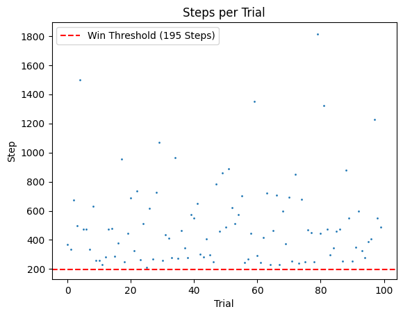
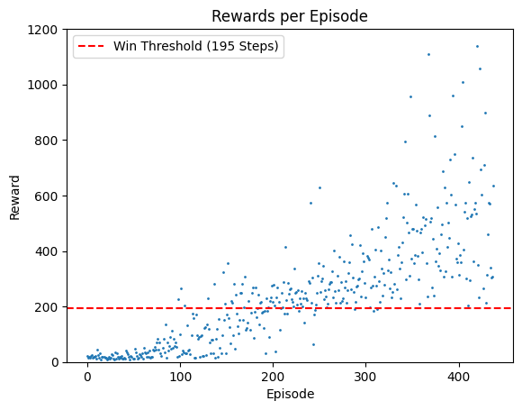
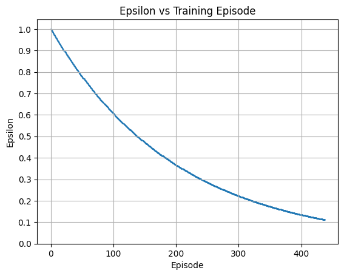
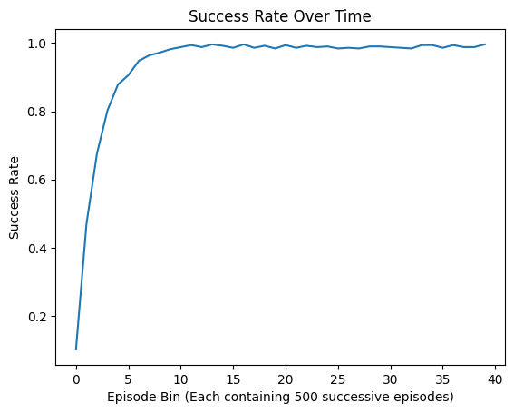

# Deep Reinforcement Learning Using Gymnasium
Solving the [CartPole classic control problem](https://gymnasium.farama.org/environments/classic_control/cart_pole/) using 3 different approaches to practice the Python Gymnasium library/API.

-------

### Summary of Results

#### Cartpole Results Summary of 3 Different RL Approaches:
| Approach | Implemented With | Wins | Median Steps | Minimum Steps | Maximum Steps | Inference Time | Training Time | Episodes Trained |
|---|---|---|---|---|---|---|---|---|
| Classical Q-Learning with Discretization | NumPy | 100 | 448 | 212 | 1814 | 2 sec | 12 min | 50,000 |
| DQN (Manual Implementation) | TensorFlow & NumPy | 100 | 808 | 254 | 5000 (x9) | 76 min | 5 hours | 438 | 
| DQN (API Implementation) | Stable Baselines 3 | 100 | 5000 | 5000 | 5000 (x100) | 1 min 51 sec | 11 min | 9,675 (1M steps) |

#### Notes:

- **Wins:**  Indicates the number, out of 100 testing trials, where the agent achieved the win criterion (>= 195 steps).
- **Median/Minimum/Maximum Steps:**  Performance of the trained agent during its 100 testing trials. The "(x#)" in the "Maximum Steps" column indicates how many times the agent reached the max number of steps (5,000) during the 100 trials. This helps to show how often the agent was hitting the environment's limit.
- **Inference Time:** The time taken for the trained agent to play 100 trials.
- **Training Time:** The time it took to train the agent.

--------

### 1) CartPole - Classical Q-Learning with Discretization
- Implemented Classical Q-Learning algorithm using NumPy
- Used discretization to handle the continuous observation space. This involved dividing the continuous range of each observation variable (cart position, cart velocity, pole angle, pole velocity) into a finite number of discrete bins.

### 2) CartPole - DQN Using a Manual Implementation
- Implemented a Deep Q-Network (DQN) solution from scratch using TensorFlow and NumPy to gain a deeper understanding of the algorithm's inner workings.
- Constructed a neural network with TensorFlow to approximate the Q-value function and a separate target network for improved learning stability.
- Developed an experience replay mechanism from scratch to enhance training stability and efficiency.

  
   

### 3) CartPole - DQN Using Stable Baselines 3
- Utilized the Stable Baselines 3 library, which provides a high-level API for training and evaluating reinforcement learning agents.
- Leveraged the built-in DQN implementation in Stable Baselines 3, configuring it for the CartPole environment.
- This approach focused on using a well-established library to streamline the development process.
- This optimized approach allowed for signficantly faster training and inference time than the manual implementation.

**Results:** The Stable Baselines 3 agent consistently achieved the maximum score of 5,000 steps over 100 trials, and was even able to maintain a score of 1 million steps in a separate test, demonstrating the effectiveness of this approach.

### 4) FrozenLake - Classical Q-Learning
- Also in this repo is a notebook solving the [FrozenLake problem](https://gymnasium.farama.org/environments/toy_text/frozen_lake/) using Classical Q-Learning.
- This was done as a stepping stone (due to the discrete observation space) prior to implementing the CartPole Classical Q-Learning solution.

#### FrozenLake Training Results:

